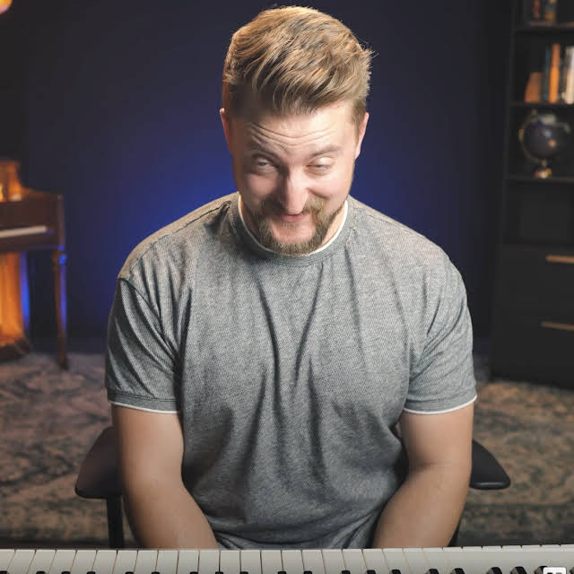
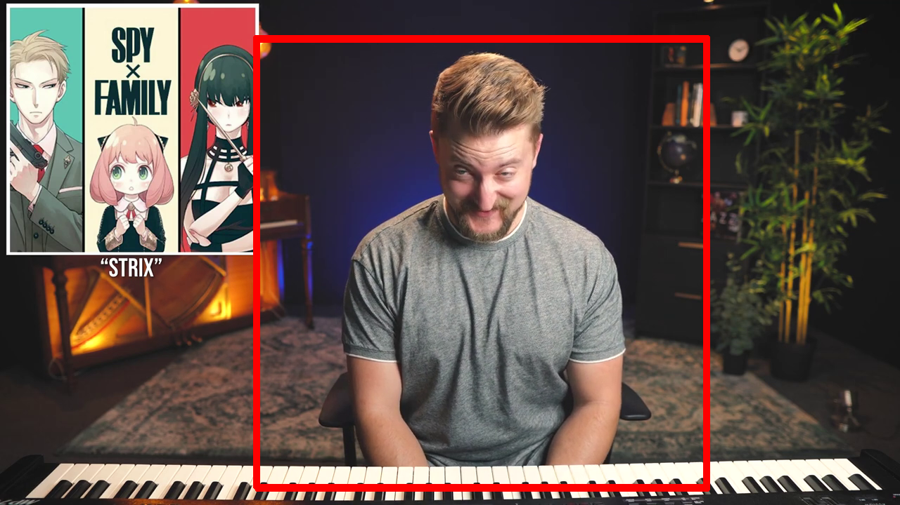

<!-- PROJECT SHIELDS -->
[![Gtest][gtest-svg]][gtest-url]

<!-- PROJECT LOGO -->
 

  

  <h1 align="center">FrameScout</h1>

  

    A console application to find cropped images within a frame of a MP4/video.
     
    <a href="https://dariustb.github.io/FrameScout/"><strong>Explore the docs »</strong></a>
     
     
    <a href="https://github.com/dariustb/FrameScout/issues">Report Bug</a>
    ·
    <a href="https://github.com/dariustb/FrameScout/issues">Request Feature</a>
  

<!-- ABOUT THE PROJECT -->
## About The Project
I wrote this (originally in Python) as a solution to a challenge issued on November 26, 2022 by pianist, educator, and YouTube creator, [Charles Cornell][cornell_yt].

Cornell basically asks in [a community post][community_post] to find this candid image from a video frame that he found hisself:

This frame will be in a video that he will post later on Youtube, *[How is the Spy Family Soundtrack THIS Good?][spy_family_video]*. Whoever emails him the correct screenshot first gets Cornell's entire selection of music courses for free ($99 value!). 

**This is begging to be automated.**

And this program will separate your video into frames and search any image (cropped or not cropped) inside of each frame:

Shout out to Flynn for getting the win!

### Built With
* [![C++][cpp.io]][cpp]
* [![CMake][cmake.io]][cmake]
* [![OpenCV][opencv.io]][opencv]
* [![Lubuntu][lubuntu.io]][lubuntu]

(<a href="#readme-top">back to top</a>)

<!-- MARKDOWN LINKS & IMAGES -->
<!-- https://www.markdownguide.org/basic-syntax/#reference-style-links -->
[repo]: git@github.com:dariustb/FrameScoutApp.git

[cornell_yt]: https://www.youtube.com/@FrameScoutStudios

[community_post]: https://www.youtube.com/channel/UC4PIiYewI1YGyiZvgNlJNrA/community?lb=Ugkxlx5jZVyfMHIXrW2T43Eut6tu1673pgBB

[spy_family_video]: https://www.youtube.com/watch?v=lFIixuIdYhY

[docs]: https://dariustb.github.io/FrameScout/

<!-- Technologies -->
[cpp]:      https://devdocs.io/cpp/
[cmake]:    https://cmake.org/
[opencv]:   https://opencv.org/
[lubuntu]:  https://lubuntu.me/

<!-- Featured images -->
[product-screenshot]:   /docs/assets/images/wf_start.png

<!-- CI Test badges -->
[gtest-svg]:  https://github.com/dariustb/FrameScout/actions/workflows/gtest.yml/badge.svg
[gtest-url]:  https://github.com/dariustb/FrameScout/actions/workflows/gtest.yml
[tidy-svg]:   https://github.com/dariustb/FrameScout/actions/workflows/clang-tidy.yml/badge.svg
[tidy-url]:   https://github.com/dariustb/FrameScout/actions/workflows/clang-tidy.yml

<!-- Markdown Badges -->
[cpp.io]:       https://img.shields.io/badge/c++-%2300599C.svg?style=for-the-badge&logo=c%2B%2B&logoColor=white
[cmake.io]:     https://img.shields.io/badge/CMake-%23008FBA.svg?style=for-the-badge&logo=cmake&logoColor=white
[opencv.io]:    https://img.shields.io/badge/opencv-%23white.svg?style=for-the-badge&logo=opencv&logoColor=white
[lubuntu.io]:   https://img.shields.io/badge/-Lubuntu-%230065C2?style=for-the-badge&logo=lubuntu&logoColor=white
